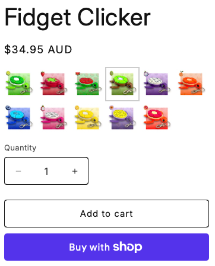
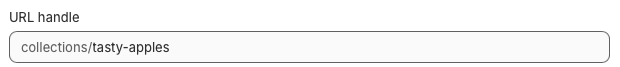
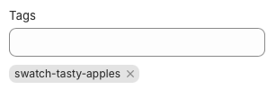

# shopify-swatches
The purpose is to select a Shopify collection, use each product’s thumbnail image, and display those images as 50px x 50px swatches on products that are tagged to reference that collection.  
 
   
 
👉 If you like this project, follow along at https://jaeitee.xyz for more updates.
 
## 📚 How to Use
#### Step 1: Create a collection for example called Tasty Apples. 
The URL handle for this at the bottom of the page will display tasty-apples. 
 
Add your products to this collection manually. 
You can also create a smart collection based on conditions, and this will also work. 

#### Step 2: Tag your Products
Add the tag **swatch-tasty-apples** to the products within that collection. 
 
Any tagged product will now display that swatch. 

#### Small Tips
This can work with all your existing collections, just look at your existing URL handles to know the swatch-<url_handle> tag. 
Customise the CSS to suit your style, change the active border colour etc. 

## 💾 Installation Instructions

### 1) Code Snippet
**Add the snippet to your theme.**  
Step 1. Online Store → Themes → Edit code → Snippets → Add new snippet 
Step 2. Name it: jaeitee-swatches.liquid 
Step 3. Paste code from jaeitee-swatches.liquid 

### 2) Create CSS File
Step 1. Online Store → Themes → Edit code → Assets → Add a new asset 
Step 2. Name: jaeitee-swatches.css 
Step 3. Paste code from jaeitee-swatches.css 

### 3) Load CSS File
Step 1. Open Layout → theme.liquid 
Step 2. Find <head> secion. 
Step 3. Add code near other stylesheets. 
<pre>{{ 'jaeitee-swatches.css' | asset_url | stylesheet_tag }}</pre>

### 4) Insert it on the Product Page
For this you have two options.  You can either add custom liquid code inside your theme editor, or continue to edit the code in the code editor.
 
**Theme Editor Option** 
Step 1: Go to Online Store -> Themes -> Edit Theme 
Step 2: Open a Product Page 
Step 3: Add a custom liquid code snippet 
Step 4: Enter the following code where you want it to appear 
<pre></pre>

**Code Edit Option** 
Step 1: Go to Online Store -> Themes -> Edit Code 
Step 2: Open sections/main-product.liquid 
Step 3: Locate where the Price output is. 
Step 4: Enter the following code: 
<pre></pre>
